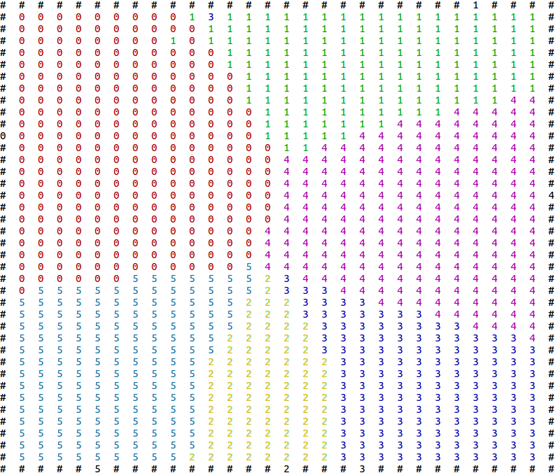

## Evacuate Simulation via GEP
---
This project is based on [GEP-Curve-Fitting](https://github.com/tankgit/GEP-Curve-Fitting).

It can be used to simulate the agents evacuation, the alogrithm generates a formulation to calculate which gate should each agent evacuate from.

With a simple example, here is the result:

- Room size: 30 x 40 unit

- Agents distribute in the room evenly.

- Result:

F( d , n , w ) = (d/ ( ( ( (w*d) *w) - (n/d) ) * ( (w*w) * (w*w) ) ) ) 



You may find that some agents apparnetly go wrong doors, just rerun the program, it may gone.

## LICENSE
```
MIT LICENSE.
COPYRIGHT (C) 2016 Derek Liu
```

2016/06/12 by Derek Liu